# Chapitre 03 — Le modèle de données corrigé

> Prérequis : [chapitre 02](02-revue-critique-du-modele.md).
> C'est le **chapitre de référence** du projet : on y reviendra constamment.
> Durée de lecture : ~45 min. À lire domaine par domaine, pas d'un bloc.

---

## 1. Ce qu'on veut faire

On transforme la spécification initiale en un modèle qui **répond aux questions
métier**, en intégrant :

- les 18 anomalies du chapitre 02 ;
- la décision [D-01](../decisions.md#d-01--produits-avec-variantes) : les variantes ;
- la décision [D-02](../decisions.md#d-02--un-responsable-peut-avoir-plusieurs-catégories) : les catégories multiples.

Le modèle passe de **~40 à 52 tables**, réparties en **11 domaines**.

---

## 2. La notion : découper un modèle en domaines

52 tables sur un seul schéma, c'est illisible. Personne ne peut le tenir en tête.

La solution n'est pas de simplifier — le métier est réellement complexe — mais
de **découper**.

> 🎯 **La règle du découpage :**
> un domaine est un ensemble de tables qui **changent ensemble**.
> Si modifier le stock t'oblige à toucher la logistique, c'est que le découpage
> est raté.

Chaque domaine a :

- une **table racine** (son point d'entrée) ;
- des tables satellites qui n'ont de sens qu'avec elle ;
- un nombre **limité** de liens vers les autres domaines.

Ces liens rares entre domaines sont précieux : ce sont eux qui deviendront
les frontières des packages Java (chapitre 06), et un jour peut-être les
frontières entre services.

### Vue d'ensemble

```text
┌─────────────────────┐   ┌─────────────────────┐   ┌─────────────────────┐
│  1. IAM             │   │  2. MARCHANDS       │   │  3. CATALOGUE       │
│  utilisateur        │──▶│  marchand           │──▶│  produit            │
│  responsable        │   │  gestion_marchand   │   │  variante  ◀── clé  │
│  categorie          │   │  regle_commission   │   │  tarification       │
│  cas_utilisation    │   └─────────────────────┘   └──────────┬──────────┘
│  adresse, appareil  │                                        │
└──────────┬──────────┘                             ┌──────────▼──────────┐
           │                                        │  4. STOCK           │
           │                                        │  stock              │
           │                                        │  mouvement_stock    │
           │                                        └──────────┬──────────┘
┌──────────▼──────────┐   ┌─────────────────────┐   ┌──────────▼──────────┐
│  6. SERVICE CLIENT  │──▶│  5. COMMERCE        │◀──│  11. MESURE         │
│  conversation       │   │  panier, commande   │   │  vue_produit        │
│  proposition_prix   │   │  ligne_commande     │   │  favori, stats jour │
└─────────────────────┘   │  paiement           │   └─────────────────────┘
                          └──────────┬──────────┘
           ┌─────────────────────────┼─────────────────────────┐
┌──────────▼──────────┐   ┌──────────▼──────────┐   ┌──────────▼──────────┐
│  7. LOGISTIQUE      │   │  8. SAV             │   │  9. FINANCE         │
│  expedition, colis  │   │  reclamation        │   │  ecriture_marchand  │
│  lieu, itineraire   │   │  retour             │   │  reglement          │
│  evenement          │   │  ligne_retour       │   └─────────────────────┘
└─────────────────────┘   └─────────────────────┘

              ┌────────────────────────────────────────────┐
              │  10. SURVEILLANCE & SYSTÈME                │
              │  activite_client, evenement_securite,      │
              │  score_risque, alerte, audit_log,          │
              │  notification, piece_jointe                │
              └────────────────────────────────────────────┘
```

---

## 3. Les conventions du modèle

Avant les diagrammes, les règles qui s'appliquent **partout**. Elles ne seront
pas répétées à chaque table.

| Règle | Détail |
|---|---|
| **Nommage** | `snake_case`, tables au **singulier**, en français. `ligne_commande`, pas `LigneCommandes`. |
| **Clé primaire** | `id bigserial` sur toutes les tables. Les tables d'association ont une clé composite. |
| **Argent** | `numeric(15,2)` — **jamais** `float`. Toujours accompagné d'une `devise char(3)`. |
| **Dates** | `timestamptz`, jamais `timestamp`. Le serveur peut être en UTC, le client à Douala. |
| **Statuts** | `varchar` + contrainte `CHECK`, avec la liste des valeurs écrite dans le schéma. |
| **Traçabilité** | Toute table modifiable a `date_creation`, `date_modification`, `cree_par`, `modifie_par`. |
| **Suppression** | On ne supprime presque rien. On passe `statut = 'ARCHIVE'`. Un produit vendu une fois ne doit jamais disparaître. |
| **Données figées** | Les colonnes copiées lors d'une transaction sont préfixées mentalement « photo ». Elles ne sont **jamais** mises à jour. |

> 💡 **Pourquoi `bigserial` et pas `uuid` ?**
> Un `bigint` est deux fois plus petit, s'indexe mieux, et les insertions
> restent séquentielles (pas de fragmentation d'index). L'`uuid` sert quand
> l'identifiant doit être généré côté client ou ne pas être devinable.
> Pour les identifiants **exposés** (numéro de commande, numéro de suivi),
> on n'expose pas l'`id` : on génère un `numero` métier (`CMD-2026-000812`).
> Sinon un client comprend en trois secondes combien tu as de commandes.

---

## 4. Domaine 1 — IAM, utilisateurs et permissions

### Ce qui change par rapport à la spec

| Correction | Origine |
|---|---|
| `utilisateur.type` distingue SUPER_ADMIN / ADMIN / RESPONSABLE / CLIENT | A1 |
| `responsable_categorie` : plusieurs catégories, dont une principale | D-02 |
| `appareil_connu` : détecter un « nouvel appareil » | A17 |
| La table `adresse` est **supprimée** | D-05 |
| `client.langue` : la langue d'interface et de notification | D-08 |

> 💡 **Pourquoi il n'y a pas de table `adresse`, ni de point de retrait
> sur le profil du client.**
>
> Le chapitre 02 (A17) réclamait une table `adresse` : sans adresse,
> impossible de livrer. Mais
> [D-05](../decisions.md#d-05--retrait-en-point-de-récupération-uniquement)
> a tranché : **on ne livre pas à domicile**, le client vient retirer.
>
> Et le point de retrait n'est pas non plus une préférence du profil :
> il est **choisi à chaque commande**, parmi les points actifs créés par
> les Admins. Il vit donc sur `commande`, pas sur `client`.
>
> C'est logique : un même client peut commander pour lui à Douala en mars,
> puis se faire livrer à Bangui en avril. Une préférence sur le profil
> aurait été fausse une fois sur deux — et surtout, elle aurait été une
> **référence** là où il faut une **photo** (règle fondatrice n°4).
>
> Deux tables disparaissent ainsi. C'est une bonne illustration de la
> méthode : une anomalie du chapitre 02 se résout parfois non pas en la
> corrigeant, mais parce qu'une **décision métier** a supprimé le besoin.
> Toujours vérifier qu'un manque en est vraiment un.

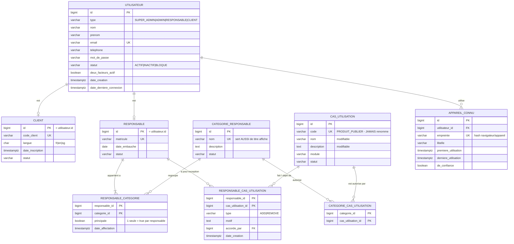

### Le calcul des permissions effectives

C'est **la** requête la plus exécutée de toute l'application. Elle doit être juste,
et elle doit être rapide.

```sql
-- Permissions effectives d'un responsable
WITH depuis_categories AS (
    SELECT DISTINCT ccu.cas_utilisation_id
    FROM responsable_categorie rc
    JOIN categorie_cas_utilisation ccu ON ccu.categorie_id = rc.categorie_id
    WHERE rc.responsable_id = :id
),
ajouts AS (
    SELECT cas_utilisation_id FROM responsable_cas_utilisation
    WHERE responsable_id = :id AND type = 'ADD'
),
retraits AS (
    SELECT cas_utilisation_id FROM responsable_cas_utilisation
    WHERE responsable_id = :id AND type = 'REMOVE'
)
SELECT cu.code
FROM cas_utilisation cu
WHERE cu.statut = 'ACTIF'
  AND cu.id IN (SELECT cas_utilisation_id FROM depuis_categories
                UNION
                SELECT cas_utilisation_id FROM ajouts)
  AND cu.id NOT IN (SELECT cas_utilisation_id FROM retraits);
```

> ⚠️ **Le piège de D-02, visible ici :**
> le `NOT IN (retraits)` s'applique **à la fin**, sur l'union complète.
> Si on soustrayait catégorie par catégorie, un `REMOVE` sur `PRIX_MODIFIER`
> ne retirerait le droit que d'une catégorie — l'autre le redonnerait.
> **La soustraction est globale, toujours.**

### Les contraintes que la base doit porter

```sql
-- Une seule categorie principale par responsable
CREATE UNIQUE INDEX responsable_categorie_principale_unique
    ON responsable_categorie (responsable_id) WHERE principale = true;

-- Une exception ne peut pas etre a la fois ADD et REMOVE
-- (garanti par la cle primaire composite responsable_id + cas_utilisation_id)
```

---

## 5. Domaine 2 — Marchands

### Ce qui change

| Correction | Origine |
|---|---|
| `regle_commission` remplace la table `commission` : c'est un **taux daté**, pas un montant | A3 |
| Le taux peut dépendre du marchand **et/ou** de la catégorie de produit | A3 |

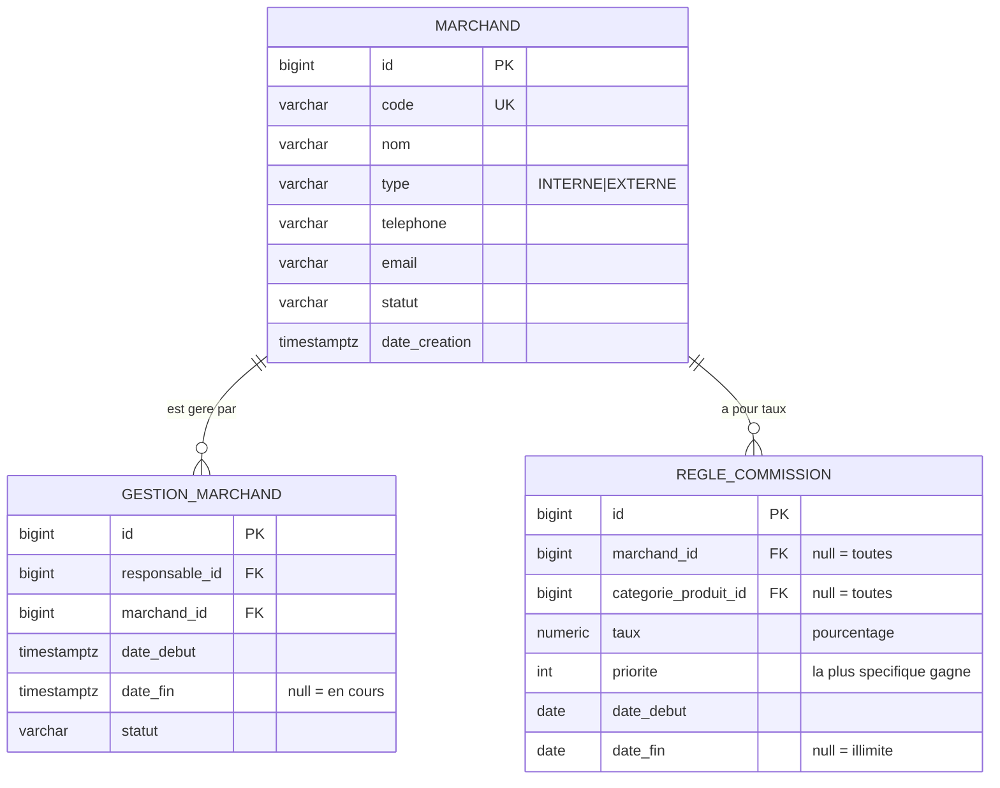

> 💡 **Pourquoi une règle datée plutôt qu'un taux sur le marchand ?**
> Parce que le taux **change**. Si tu le stockes sur `marchand` et qu'il passe
> de 10 % à 12 %, toutes les ventes passées deviennent inexplicables.
> Une règle datée dit : « du 1er janvier au 30 juin, c'était 10 % ».
>
> Et surtout : le taux **appliqué** est copié dans `ligne_commande` au moment
> de la vente (règle de la photographie, [A13](02-revue-critique-du-modele.md)).
> La règle sert à *calculer*, la ligne de commande sert à *prouver*.

---

## 6. Domaine 3 — Catalogue et variantes

C'est le domaine le plus modifié, à cause de [D-01](../decisions.md#d-01--produits-avec-variantes).

### La notion : produit, variante, attribut

Trois concepts qu'il ne faut jamais confondre :

```text
PRODUIT      « Chemise Oxford »
             Ce que le CLIENT voit dans le catalogue.
             Porte le nom, la description, les photos, le marchand.
             ❌ N'a NI prix NI stock.

VARIANTE     « Chemise Oxford — M — Bleu »   SKU: CHO-M-BLE
             Ce qu'on VEND réellement.
             Porte le prix et le stock.
             ✅ C'est elle qu'on met au panier.

ATTRIBUT     « Taille », « Couleur »
             La grille de déclinaison.
             VALEUR_ATTRIBUT : « M », « Bleu »
```

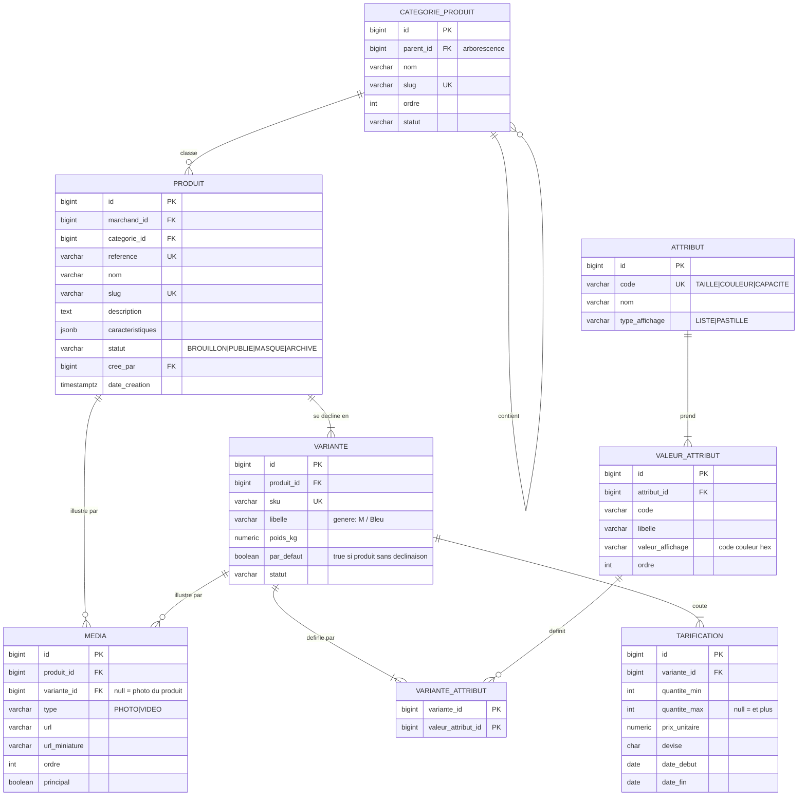

> ⚠️ **Le piège n°1 des variantes : le double chemin de code.**
> Un sac de ciment n'a pas de déclinaison. Tentation : « pas de variante,
> le prix va sur le produit ».
> **Non.** Il aura **une** variante, marquée `par_defaut = true`.
>
> Sinon tout le code aval devient :
> `if (produit.aDesVariantes()) { ... } else { ... }`
> Ce `if` se retrouve dans le panier, la commande, le stock, le colis,
> les statistiques. Il finit toujours par être oublié quelque part.
>
> **Un seul chemin, toujours.** C'est le prix de la simplicité.

> ⚠️ **Le piège n°2 : les paliers de prix qui se chevauchent.**
> `1–4 → 15 000` et `3–10 → 13 000`. Quel prix pour 3 unités ?
> La base doit l'interdire. PostgreSQL sait le faire nativement :
>
> ```sql
> ALTER TABLE tarification ADD CONSTRAINT tarification_sans_chevauchement
>   EXCLUDE USING gist (
>     variante_id WITH =,
>     int4range(quantite_min, COALESCE(quantite_max, 2147483647), '[]') WITH &&
>   );
> ```
>
> C'est une **contrainte d'exclusion**. Elle n'existe pas en MySQL.
> Elle rend le chevauchement littéralement impossible, même si le code Java
> est bugué. C'est exactement la règle fondatrice n°5 du chapitre 02.

---

## 7. Domaine 4 — Stock

### Ce qui change

| Correction | Origine |
|---|---|
| Le stock est sur la **variante**, plus sur le produit | D-01 |
| `quantite_vendue` (un cumul) sort de `stock` | A5 |
| `mouvement_stock` dit **pourquoi** il a eu lieu (`origine_type`, `origine_id`) | A5 |
| `quantite_avant` / `quantite_apres` pour pouvoir auditer | A5 |

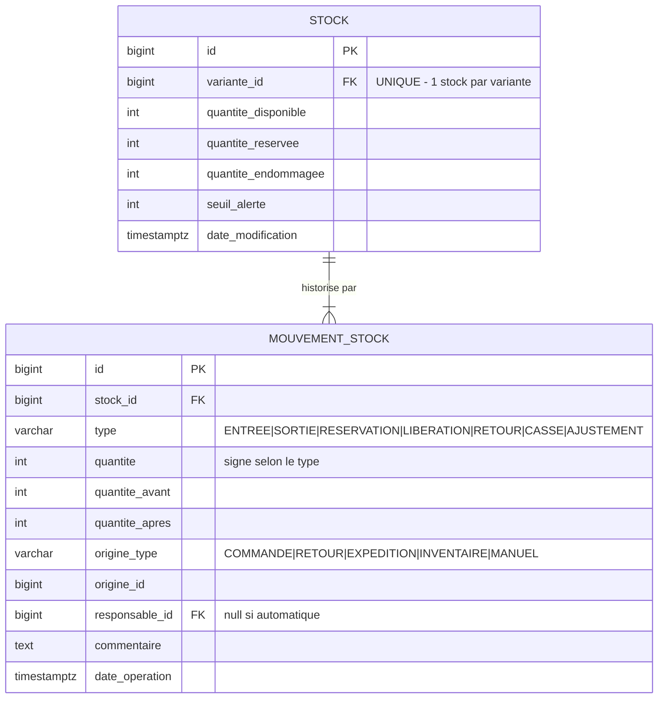

### Le vrai sujet : la concurrence

Deux clients commandent le dernier article **à la même seconde**.

```text
        Client A                    Client B
           │                           │
      SELECT quantite ──► 1       SELECT quantite ──► 1
           │                           │
      "il en reste 1, OK"         "il en reste 1, OK"
           │                           │
      UPDATE quantite = 0         UPDATE quantite = 0
           │                           │
           ▼                           ▼
              ❌ L'article est vendu DEUX fois
```

Ce bug **ne se voit pas** en développement (on est seul) et **ne se voit pas**
dans les tests unitaires. Il apparaît le jour d'une promotion.

Trois parades, de la pire à la meilleure :

| Parade | Verdict |
|---|---|
| `synchronized` en Java | ❌ Ne marche que sur **un** serveur. Cassé dès qu'il y en a deux. |
| Verrou pessimiste (`SELECT ... FOR UPDATE`) | ✅ Correct. Sérialise les acheteurs d'un même article. |
| Contrainte SQL `CHECK (quantite_disponible >= 0)` + `UPDATE ... WHERE quantite >= :n` | ✅✅ La meilleure : la base **refuse** l'état impossible. |

En pratique on combine les deux dernières :

```sql
-- Reserver n unites : ne passe QUE s'il y en a assez.
UPDATE stock
SET quantite_disponible = quantite_disponible - :n,
    quantite_reservee   = quantite_reservee   + :n
WHERE variante_id = :variante AND quantite_disponible >= :n;
-- 0 ligne modifiee  ⇒  stock insuffisant  ⇒  on refuse la commande
```

> 📌 **La leçon : ne demande jamais à la base « combien y en a-t-il ? »
> pour décider ensuite. Demande-lui de faire l'opération, et regarde
> si elle a réussi.**
> Entre le `SELECT` et l'`UPDATE`, le monde a changé.
>
> Sujet complet du chapitre 17.

---

## 8. Domaine 5 — Commerce

### Ce qui change

| Correction | Origine |
|---|---|
| `panier` historisé, un seul `ACTIF` par client | A8 |
| `commande.conversation_id` nullable (le bon sens de la relation) | A7 |
| `ligne_commande` porte le **marchand figé** et la **commission figée** | A13 |
| `commande` détaille articles / frais / remise / total | A17 |
| `paiement` : type, référence opérateur, échecs | A12 |
| Pas d'adresse : `point_recuperation_id` est **obligatoire** | D-05 |
| Pas d'espèces : le paiement précède l'expédition | D-06 |
| `montant_frais` = frais d'acheminement du point choisi | D-10 |
| Pas de TVA en v1, mais des montants séparés | D-11 |

### Les frais d'acheminement

Le client paie un supplément qui dépend du **point de récupération choisi** :

```text
lieu                          frais_acheminement
─────────────────────────────────────────────────
Douala — Akwa                        1 000 FCFA
Bertoua — Centre                     3 500 FCFA
Bangui — PK5                         8 000 FCFA
```

Au moment de la commande, ce montant est **copié** dans `commande.montant_frais`.

> 🎯 **Encore la règle de la photographie — et cette fois tu peux prédire
> pourquoi.**
> Le tarif Bangui passera de 8 000 à 9 500 FCFA. Si `commande` ne stockait
> qu'un lien vers `lieu`, toutes les commandes passées afficheraient
> rétroactivement 9 500 — et le total ne correspondrait plus à ce que le
> client a réellement payé. La contrainte
> `montant_total = articles + frais − remise` sauterait sur **toutes** les
> anciennes commandes.
>
> Une contrainte qui casse quand une donnée de référence change est le
> meilleur détecteur de référence-au-lieu-de-copie qui soit.

> 💡 **Pourquoi le tarif est une simple colonne sur `lieu`, et pas une table
> datée comme `regle_commission` ?**
> Parce que la commande **fige** le montant. Le tarif n'a donc pas besoin
> d'être historisé pour reconstituer le passé : le passé est déjà dans les
> commandes.
>
> `regle_commission`, elle, est datée parce qu'on doit pouvoir **recalculer**
> une commission a posteriori en cas de litige avec un marchand.
>
> **La règle : on historise une donnée de référence uniquement quand on doit
> pouvoir rejouer un calcul. Sinon, la photo dans la transaction suffit.**

### La conséquence majeure de D-06 : le paiement conditionne tout

Sans paiement à la récupération, la commande n'est **jamais** préparée avant
d'être payée. Le cycle devient linéaire, et c'est une excellente nouvelle :

```text
EN_ATTENTE_PAIEMENT ──paiement confirmé──▶ PAYEE ──▶ EN_PREPARATION
                                                          │
                                                          ▼
        RETIREE ◀── DISPONIBLE ◀── EXPEDIEE ◀────────── PRETE
             │
             └──▶ (réclamation / retour possibles)

           ANNULEE   ← accessible depuis EN_ATTENTE_PAIEMENT et PAYEE
```

**Ce que ça élimine, et qui aurait été très coûteux :**

| Risque évité | Pourquoi il disparaît |
|---|---|
| Marchandise acheminée puis jamais retirée ni payée | On ne bouge rien avant d'être payé |
| Gestion d'un encaissement en espèces dans chaque point de retrait | Il n'y en a pas |
| Réconciliation de caisse par point de récupération | Sans objet |
| Client insolvable après expédition | Impossible |

> ⚠️ **Le nouveau risque, en échange :** le paiement mobile money est
> **asynchrone**. Le client valide sur son téléphone, l'opérateur confirme
> quelques secondes — ou quelques minutes — plus tard, par un *webhook*.
>
> Entre les deux, la commande est en `EN_ATTENTE_PAIEMENT` et le stock doit
> être **réservé** (`quantite_reservee`), pas encore décrémenté.
> Si la confirmation n'arrive jamais, un travail périodique libère la
> réservation et annule la commande.
>
> C'est pour ça que `stock` distingue `quantite_disponible` et
> `quantite_reservee` — la distinction paraissait théorique au §7,
> elle devient ici indispensable.

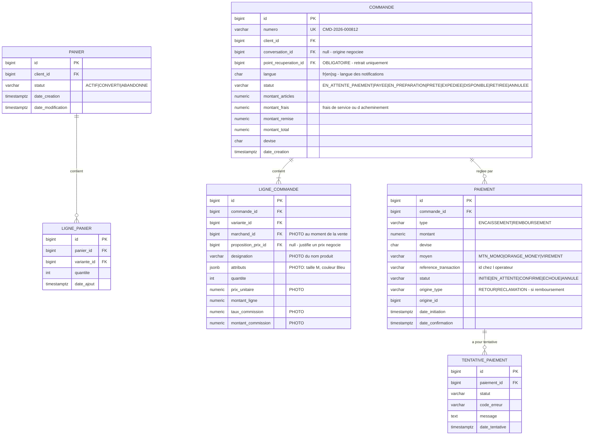

### La règle de la photographie, en pratique

Regarde `ligne_commande`. Cinq colonnes sont des **copies** :
`designation`, `attributs`, `prix_unitaire`, `marchand_id`, `taux_commission`.

Pourquoi ne pas simplement joindre `variante` et `produit` ?

```text
Le 12 mars, le client achète « Chemise Oxford — M — Bleu » à 15 000 FCFA,
appartenant au marchand ABC, commission 10 %.

Le 20 mars :
  • le produit est renommé « Chemise Oxford Premium »
  • il passe au marchand XYZ           (PRODUIT_MODIFIER_MARCHAND existe !)
  • le prix monte à 18 000 FCFA
  • la commission passe à 12 %

Le 25 mars, le client conteste sa facture.

SANS photographie → la facture affiche :
    « Chemise Oxford Premium — 18 000 FCFA — marchand XYZ — commission 12 % »
    ❌ Faux sur les quatre points. Et on doit de l'argent au mauvais marchand.

AVEC photographie → la facture affiche ce qui a réellement été vendu.
```

> 📌 **Règle fondatrice n°4, rappelée :**
> une **référence** pointe vers une donnée qui changera.
> Une **copie** est un fait qui ne changera plus.
> Dans une transaction, on veut des faits.

### Les contraintes à poser

```sql
-- Un seul panier actif par client (A8)
CREATE UNIQUE INDEX panier_actif_unique
    ON panier (client_id) WHERE statut = 'ACTIF';

-- Une variante n apparait qu une fois dans un panier
ALTER TABLE ligne_panier ADD CONSTRAINT ligne_panier_unique
    UNIQUE (panier_id, variante_id);

-- Les montants sont coherents
ALTER TABLE commande ADD CONSTRAINT commande_total_coherent
    CHECK (montant_total = montant_articles + montant_frais - montant_remise);
```

Cette dernière contrainte vaut de l'or : elle rend un total faux **impossible
à écrire**, quelle que soit l'erreur du code Java.

---

## 9. Domaine 6 — Service client et négociation

### Ce qui change

| Correction | Origine |
|---|---|
| `proposition_prix` porte variante, quantité, auteur, sens, expiration | A6 |
| Chaînage des contre-propositions (`proposition_parente_id`) | A6 |
| `affectation_conversation` trace les retraits/réaffectations par l'Admin | §4 de la spec |

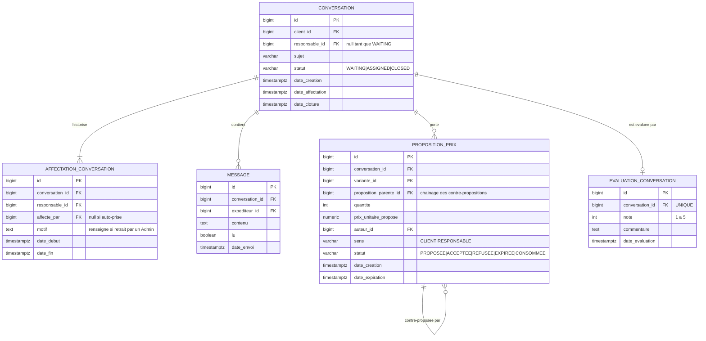

### Le cycle d'une négociation

```text
Client            « 12 000 pour 20 pièces ? »
                     PROPOSITION #1  sens=CLIENT  statut=PROPOSEE
                            │
Responsable       « 13 500 »
                     PROPOSITION #2  sens=RESPONSABLE  parente=#1
                            │              expire le 30/09
Client            accepte
                     PROPOSITION #2  statut=ACCEPTEE
                            │
Commande          LIGNE_COMMANDE.prix_unitaire      = 13 500
                  LIGNE_COMMANDE.proposition_prix_id = #2
                     PROPOSITION #2  statut=CONSOMMEE
```

> 🎯 **Pourquoi `proposition_prix_id` dans `ligne_commande` ?**
> Sans elle, un contrôleur voit une vente à 13 500 alors que le tarif est
> 15 000, et ne peut pas savoir **qui** a accordé la remise ni **pourquoi**.
> C'est un trou de contrôle interne — le genre de trou par lequel l'argent part.
>
> Avec elle : la remise pointe vers une proposition, qui pointe vers un
> responsable et une date. Tout écart est justifiable.

> ⚠️ **La question ouverte : l'affectation d'une conversation.**
> La spec dit qu'un Responsable « prend » une conversation `WAITING`, et
> qu'aucun autre ne peut plus la prendre. C'est encore un problème de
> concurrence, exactement comme le stock :
>
> ```sql
> UPDATE conversation SET responsable_id = :moi, statut = 'ASSIGNED'
> WHERE id = :conv AND statut = 'WAITING';   -- 0 ligne = quelqu'un a ete plus rapide
> ```
>
> Jamais un `SELECT` suivi d'un `UPDATE`.

---

## 10. Domaine 7 — Logistique

### Ce qui change

| Correction | Origine |
|---|---|
| `lieu` unifie entrepôt / point de transit / point de récupération | A10 |
| `itineraire` devient un **modèle** ; le trajet réel vit dans les événements | A9 |
| `expedition.itineraire_id` devient nullable | A9 |
| `ligne_colis` : on sait enfin ce qu'il y a dans un colis | A13 |
| Le `statut` est une **projection** des événements | A11 |

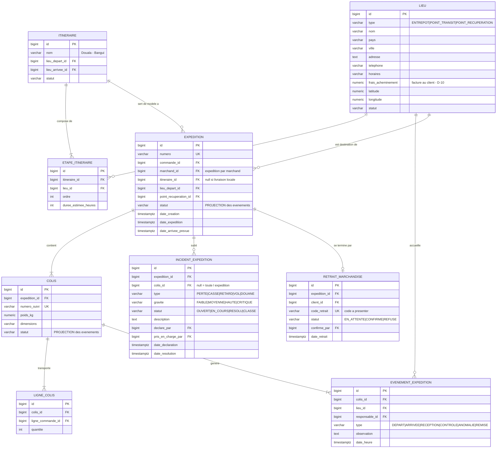

### Modèle prévu vs trajet réel

```text
ITINERAIRE « Douala → Bangui »          ce qui ÉTAIT PRÉVU
   étape 1  Douala
   étape 2  Yaoundé
   étape 3  Bertoua
   étape 4  Garoua-Boulaï
   étape 5  Bangui

ÉVÉNEMENTS du colis n°42                ce qui S'EST PASSÉ
   12/03 08:00  DEPART     Douala          David
   12/03 19:30  ARRIVEE    Yaoundé         Marie
   13/03 07:00  DEPART     Yaoundé         Marie
   13/03 22:00  ARRIVEE    Bertoua         Paul
   14/03 06:00  ANOMALIE   Bertoua         Paul   « route coupée »
   15/03 09:00  DEPART     Bertoua         Paul
   15/03 20:00  ARRIVEE    Batouri         Jean   ← HORS itinéraire
   ...
```

> 🎯 **Pourquoi `evenement_expedition.lieu_id` ne doit surtout pas être
> contraint à appartenir à l'itinéraire :**
> la réalité ne respecte pas le plan. Une route est coupée, un camion est
> dérouté. Si la base refuse d'enregistrer le passage par Batouri, l'opérateur
> saisira **n'importe quoi d'autre** pour continuer son travail — et la
> traçabilité est perdue.
>
> **Une contrainte qui empêche d'enregistrer la réalité est une mauvaise
> contrainte.** Contraindre l'*intégrité* (le lieu existe), jamais la *conformité
> au plan* (l'écart au plan est une information, pas une erreur).

---

## 11. Domaine 8 — SAV

### Ce qui change

| Correction | Origine |
|---|---|
| `ligne_retour` : le retour partiel devient possible | A4 |
| Le retour connaît ses conséquences (stock, remboursement) | A4 |

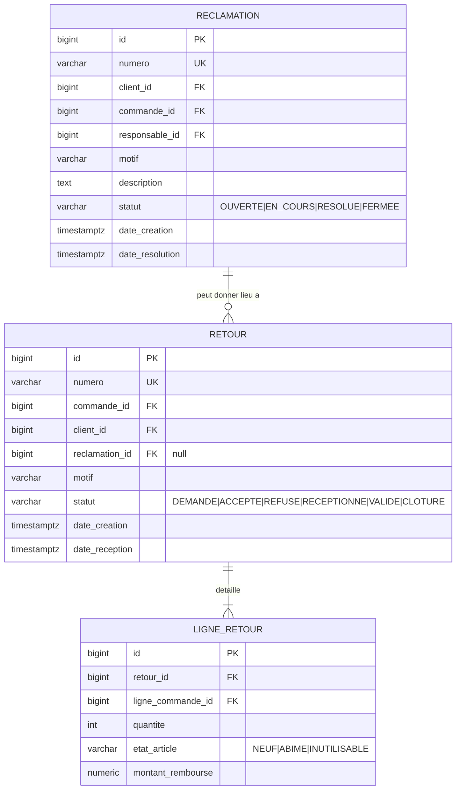

### Un retour est une opération, pas un post-it

Le client renvoie **3 chemises sur 10**, dont 1 abîmée.
Voici **tout** ce qui doit être écrit :

```text
1. RETOUR                    statut = RECEPTIONNE
2. LIGNE_RETOUR              ligne_commande #55, quantite 2, etat NEUF
3. LIGNE_RETOUR              ligne_commande #55, quantite 1, etat ABIME
4. MOUVEMENT_STOCK  +2       type RETOUR      → quantite_disponible
5. MOUVEMENT_STOCK  +1       type CASSE       → quantite_endommagee
6. PAIEMENT                  type REMBOURSEMENT, origine RETOUR #12
7. ECRITURE_MARCHAND  −      annule la vente des 3 unités
8. ECRITURE_MARCHAND  +      annule la commission des 3 unités
9. AUDIT_LOG                 qui a validé ce retour
```

Neuf écritures. **Dans une seule transaction.**
Si l'une échoue, aucune ne doit rester : c'est tout le sujet des transactions
(chapitre 07).

> 💡 **Notion : l'atomicité.**
> Le « A » de ACID. Un ensemble d'écritures est indivisible : tout passe,
> ou rien ne passe. Un retour à moitié enregistré (stock remis mais client
> non remboursé) est pire que pas de retour du tout — parce que personne
> ne s'en apercevra.

---

## 12. Domaine 9 — Finance marchand

### Ce qui change

| Correction | Origine |
|---|---|
| `dette_marchand` **disparaît** : un solde ne se stocke pas | A3 |
| `ecriture_marchand` : le grand livre, source unique de vérité | A3 |

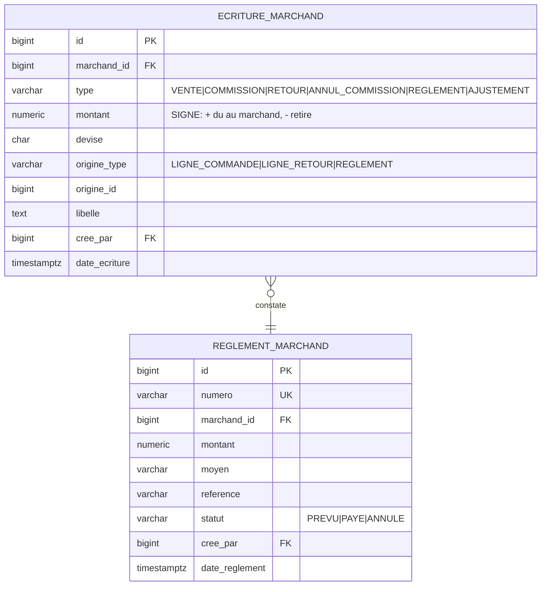

### Le grand livre en action

Vente de 10 chemises à 15 000 pour le marchand ABC, commission 10 % :

```text
type              montant       origine
──────────────────────────────────────────────────────
VENTE            +150 000       ligne_commande #55
COMMISSION        −15 000       ligne_commande #55
                 ─────────
solde                          +135 000   dû au marchand

Puis retour de 3 unités :
RETOUR            −45 000       ligne_retour #7
ANNUL_COMMISSION   +4 500       ligne_retour #7
                 ─────────
solde                           +94 500

Puis règlement :
REGLEMENT         −94 500       reglement #3
                 ─────────
solde                                 0   ✅
```

Le solde dû est **toujours** :

```sql
SELECT COALESCE(SUM(montant), 0) AS solde
FROM ecriture_marchand
WHERE marchand_id = :id AND devise = 'XAF';
```

> 📌 **Pourquoi c'est infiniment supérieur à une colonne `dette.montant` :**
>
> 1. Le solde est **prouvable** — on peut afficher les 400 lignes qui le composent.
> 2. Il est **recalculable** — une erreur se corrige par une écriture d'ajustement,
>    jamais par un `UPDATE` qui efface l'histoire.
> 3. Il est **auditable** — chaque ligne pointe vers sa pièce justificative.
> 4. Il ne peut pas **désynchroniser**, puisqu'il n'est stocké nulle part.
>
> C'est le principe de la comptabilité en partie double, vieux de 500 ans.
> Il n'a jamais été battu.

⚡ **Et la performance ?** Si un jour la somme devient lente, on ajoute une table
`solde_marchand` mise à jour en parallèle — mais uniquement comme **cache**,
avec un travail nocturne qui la recalcule et alerte en cas d'écart.
Le grand livre reste la vérité. **Toujours dans ce sens, jamais l'inverse.**

---

## 13. Domaine 10 — Surveillance, audit, système

### Ce qui change

| Correction | Origine |
|---|---|
| `score_risque_client` devient explicable (`details`, `version_algorithme`) | A14 |
| `audit_log` en `jsonb` + copie du nom de l'acteur | A18 |
| `piece_jointe` générique | A17 |

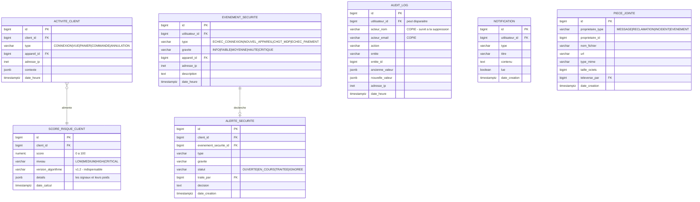

### Un score explicable

```json
{
  "score": 78,
  "niveau": "HIGH",
  "version_algorithme": "v1.2",
  "details": {
    "signaux": [
      { "code": "ECHECS_CONNEXION",  "valeur": 7,     "poids": 25, "libelle": "7 échecs en 1 h" },
      { "code": "NOUVEL_APPAREIL",   "valeur": true,  "poids": 15, "libelle": "appareil inconnu" },
      { "code": "ECHECS_PAIEMENT",   "valeur": 4,     "poids": 30, "libelle": "4 paiements refusés" },
      { "code": "VITESSE_COMMANDE",  "valeur": 12,    "poids":  8, "libelle": "12 commandes en 10 min" }
    ]
  }
}
```

L'écran d'administration n'affiche pas « 78 ». Il affiche **les quatre phrases**.

> ⚠️ **Pourquoi `version_algorithme` est indispensable :**
> tu vas améliorer le calcul. Un score de 78 en v1.0 et un 78 en v1.2 ne
> veulent pas dire la même chose. Sans la version, comparer deux scores dans
> le temps n'a **aucun sens** — et une décision de blocage prise sur cette
> comparaison est arbitraire.

> ⚠️ **`audit_log` et la clé étrangère :**
> un log doit survivre à la disparition de son acteur. D'où la copie
> `acteur_nom` / `acteur_email`. La FK reste (pratique pour joindre), mais
> en `ON DELETE SET NULL` — jamais `CASCADE`.
> **Un audit qu'on peut effacer en supprimant un utilisateur n'est pas un audit.**

---

## 14. Domaine 11 — Mesure et statistiques

C'est le domaine entièrement **absent** de la spec initiale ([A2](02-revue-critique-du-modele.md)).

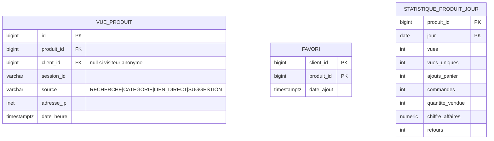

### Écriture détaillée, lecture agrégée

```text
     PENDANT LA JOURNÉE                       CHAQUE NUIT              LES ÉCRANS
┌──────────────────────────┐          ┌────────────────────┐     ┌──────────────────┐
│  vue_produit             │          │  agrégation        │     │  « Top produits  │
│  1 ligne par vue         │  ─────►  │  GROUP BY          │ ──► │    du mois »     │
│  (des millions)          │          │  produit, jour     │     │                  │
└──────────────────────────┘          └────────────────────┘     │  lit 30 lignes   │
                                                 │                │  au lieu de      │
                                                 ▼                │  3 000 000       │
                                      statistique_produit_jour    └──────────────────┘
                                      1 ligne par produit/jour
```

Le calcul des « produits tendance » devient alors une requête simple :

```sql
-- Dynamique recente : ventes des 7 derniers jours vs les 7 precedents
SELECT produit_id,
       SUM(quantite_vendue) FILTER (WHERE jour >= CURRENT_DATE - 7)  AS recent,
       SUM(quantite_vendue) FILTER (WHERE jour <  CURRENT_DATE - 7)  AS precedent,
       SUM(vues)            FILTER (WHERE jour >= CURRENT_DATE - 7)  AS vues_recentes
FROM statistique_produit_jour
WHERE jour >= CURRENT_DATE - 14
GROUP BY produit_id
ORDER BY recent DESC;
```

> 💡 **Notion PostgreSQL : `FILTER`.**
> `SUM(x) FILTER (WHERE condition)` calcule plusieurs agrégats sur des
> sous-ensembles différents **en une seule lecture** de la table.
> Standard SQL, mais peu connu — et bien plus lisible que trois sous-requêtes.

### Purge

`vue_produit` va grossir vite. Il faut décider dès maintenant :

```text
vue_produit           conservé 90 jours, puis supprimé
statistique_..._jour  conservé pour toujours (une ligne par produit/jour, c'est minuscule)
```

C'est une décision à prendre — voir les questions en fin de chapitre.

---

## 15. Domaine 12 — Le multilingue

[D-08](../decisions.md#d-08--trois-langues--français-anglais-sango) impose trois
langues : **français**, **anglais**, **sango**.

### La notion : deux multilingues très différents

C'est la distinction qu'il ne faut surtout pas rater :

| | Texte d'**interface** | Texte de **contenu** |
|---|---|---|
| Exemple | « Ajouter au panier », « Commande confirmée » | « Chemise Oxford », description du produit |
| Qui l'écrit | Le développeur | Le Responsable, dans le back-office |
| Où il vit | Des fichiers `fr.json`, `en.json`, `sg.json` | **La base de données** |
| Quand il change | À chaque livraison de code | À tout moment, sans redéploiement |
| Impact modèle | ❌ aucun | ✅ des tables de traduction |

Une équipe sur deux ne traite que le premier cas, découvre le second six mois
plus tard, et doit alors migrer tout son catalogue.

### La décision retenue : l'interface seulement

[D-09](../decisions.md#d-09--multilingue--linterface-seulement) tranche :
**seule l'interface est traduite**, dans les trois applications, back-office
compris. Le **contenu du catalogue reste en français**.

Conséquence directe sur le modèle : **il n'y a aucune table de traduction**.
Le domaine 12 se réduit à une seule table de référence.

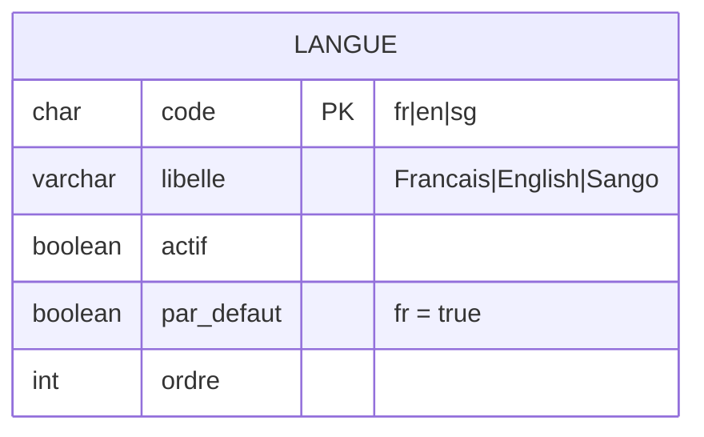

Et deux colonnes ailleurs :

```text
client.langue       la préférence d'affichage du client
commande.langue     PHOTO : la langue d'émission du document
```

> 💡 **Pourquoi garder une table `langue` alors que trois codes en dur
> suffiraient ?**
> Pour pouvoir **désactiver** une langue sans redéployer. Le jour où le
> sango n'est plus maintenu, un Admin décoche `actif` et la langue disparaît
> du sélecteur — sans toucher au code, et sans casser les comptes des
> clients qui l'avaient choisie (le repli joue).
>
> Une table de trois lignes qui évite un déploiement est une bonne table.

### Le problème du back-office trilingue

Il y a un piège, et il faut le voir maintenant.

Le back-office est en trois langues. Or il affiche des libellés qui viennent
de la **base de données** :

```text
CAS_UTILISATION
  code         PRODUIT_PUBLIER      ← technique, stable, jamais renommé
  nom          « Publier un produit »   ← affiché à l'écran
  description  « Permet de publier… »   ← affiché à l'écran
```

Ces ~180 libellés sont du **contenu**, pas de l'interface. Si on suit la règle
« le contenu n'est pas traduit », l'écran de gestion des permissions reste en
français alors que le reste du back-office est traduit. Incohérent.

**La solution, et c'est une jolie astuce :** le `code` sert de clé de traduction.

```text
Base de données                 Fichiers d'interface
─────────────────────           ──────────────────────────────────────────
cas_utilisation                 fr.json  "perm.PRODUIT_PUBLIER":
  code PRODUIT_PUBLIER                     "Publier un produit"
  nom  « Publier un produit »   en.json  "perm.PRODUIT_PUBLIER":
       (repli si pas de clé)              "Publish a product"
                                sg.json  "perm.PRODUIT_PUBLIER":
                                           "Sïgïgî na produit"
```

L'interface cherche d'abord `perm.{code}` dans ses fichiers de langue.
Si la clé n'existe pas, elle affiche `cas_utilisation.nom` (donc le français).

> 🎯 **Pourquoi ça marche ici et pas ailleurs :**
> parce que le `code` est **stable et fini**. Il y a ~180 permissions, créées
> par le SuperAdmin, qui ne changent presque jamais.
>
> Ça ne marcherait **pas** pour les produits : ils sont des milliers, créés
> tous les jours par des Responsables, et il faudrait redéployer l'application
> à chaque nouveau produit.
>
> **La règle générale :** un contenu *fini et stable* peut être traité comme
> de l'interface. Un contenu *ouvert et vivant* doit être traduit en base.

### Ce qui est traduit, et ce qui ne l'est pas

| Élément | Traduit ? | Où |
|---|---|---|
| Boutons, menus, messages, erreurs | ✅ 3 langues | `fr.json` / `en.json` / `sg.json` |
| Statuts (`PAYEE`, `EXPEDIEE`) | ✅ 3 langues | Le code stocke `PAYEE`, l'interface traduit |
| Libellés des permissions | ✅ 3 langues | Via le `code` comme clé (astuce ci-dessus) |
| Notifications et e-mails | ✅ 3 langues | Gabarits par langue, choisis via `commande.langue` |
| **Nom et description produit** | ❌ français | Saisis une fois, dans le back-office |
| Catégories, attributs, valeurs | ❌ français | Idem |
| Noms de marchands, de lieux, de villes | ❌ | Ce sont des noms propres |
| `audit_log`, journaux techniques | ❌ | Lus par des développeurs |

> 💡 **Pourquoi `commande.langue` est figée à la commande.**
> Le client commande en sango. Six mois plus tard, il passe son compte en
> français. Sa facture de mars doit-elle changer de langue ?
> **Non** — c'est un document émis. La langue de l'émission est un fait,
> donc une photo. Encore la règle fondatrice n°4.

### Si un jour il faut traduire le catalogue

C'est possible, et le modèle actuel ne s'y oppose pas. La migration serait :

```text
1. créer produit_traduction (produit_id, langue, nom, description)
2. y recopier le contenu français existant, avec langue = 'fr'
3. supprimer produit.nom et produit.description
4. adapter les lectures avec un repli :
      COALESCE(traduction_demandée, traduction_fr)
```

> ⚠️ **Le piège à éviter ce jour-là : la table de traduction générique.**
> La tentation sera d'écrire **une seule** table pour tout :
>
> ```text
> TRADUCTION (entite_type, entite_id, champ, langue, valeur)
>            ('PRODUIT',   42,        'nom', 'en',   'Oxford Shirt')
> ```
>
> C'est séduisant, et c'est un piège. Cette table n'a **aucune** clé étrangère
> possible (`entite_id` pointe vers six tables), oblige à une jointure **par
> champ** au lieu d'une par entité, rend impossible une contrainte
> « tout produit a un nom en français », et devient la table la plus
> volumineuse et la plus lente de la base.
>
> **Une table de traduction par entité traduite.** Plus de tables,
> infiniment plus sain.

---

## 16. Récapitulatif des 52 tables

| Domaine | Tables |
|---|---|
| **1. IAM** | `utilisateur`, `client`, `responsable`, `categorie_responsable`, `responsable_categorie`, `cas_utilisation`, `categorie_cas_utilisation`, `responsable_cas_utilisation`, `appareil_connu` |
| **2. Marchands** | `marchand`, `gestion_marchand`, `regle_commission` |
| **3. Catalogue** | `categorie_produit`, `produit`, `attribut`, `valeur_attribut`, `variante`, `variante_attribut`, `media`, `tarification` |
| **4. Stock** | `stock`, `mouvement_stock` |
| **5. Commerce** | `panier`, `ligne_panier`, `commande`, `ligne_commande`, `paiement`, `tentative_paiement` |
| **6. Service client** | `conversation`, `affectation_conversation`, `message`, `proposition_prix`, `evaluation_conversation` |
| **7. Logistique** | `lieu`, `itineraire`, `etape_itineraire`, `expedition`, `colis`, `ligne_colis`, `evenement_expedition`, `incident_expedition`, `retrait_marchandise` |
| **8. SAV** | `reclamation`, `retour`, `ligne_retour` |
| **9. Finance** | `ecriture_marchand`, `reglement_marchand` |
| **10. Système** | `activite_client`, `evenement_securite`, `score_risque_client`, `alerte_securite`, `audit_log`, `notification`, `piece_jointe` |
| **11. Mesure** | `vue_produit`, `favori`, `statistique_produit_jour` |
| **12. Multilingue** | `langue` |

**Tables supprimées de la spec :** `commission` (→ `regle_commission`),
`dette_marchand` (→ calculé), `point_transit` et `point_recuperation` (→ `lieu`),
`media_produit` et `tarification_produit` (→ renommées et déplacées sur la variante).

**Tables envisagées puis abandonnées :**

- `adresse` — rendue inutile par D-05 (retrait en point uniquement) ;
- `produit_traduction` et les 3 autres tables de traduction — rendues inutiles
  par D-09 (seule l'interface est traduite).

Cinq tables évitées grâce à deux décisions métier. C'est la meilleure façon
de réduire un modèle : **supprimer le besoin**, pas la rigueur.

---

## 17. À retenir

1. **52 tables, 11 domaines.** On ne regarde jamais les 52 d'un coup.
2. Un domaine est un ensemble de tables qui **changent ensemble**.
3. **Photographier, pas référencer** : `ligne_commande` copie 5 champs, et c'est volontaire.
4. **Un solde ne se stocke pas** : `ecriture_marchand` est la seule vérité financière.
5. **Toujours une variante**, même pour un produit sans déclinaison. Un seul chemin de code.
6. **Ne demande pas, agis** : `UPDATE ... WHERE quantite >= n` plutôt que `SELECT` puis `UPDATE`.
7. Une contrainte qui **empêche d'enregistrer la réalité** est une mauvaise contrainte.
8. **Écriture détaillée, lecture agrégée** pour tout ce qui se compte en millions.
9. **Texte d'interface ≠ texte de contenu.** Le premier vit dans des fichiers, le second en base.
10. Une **décision métier** peut supprimer un besoin plutôt que de le corriger : `adresse` a disparu.

---

## 18. Exercices

**Exercice 1.**
Écris la requête qui donne, pour la commande `CMD-2026-000812`, le montant dû
à chaque marchand. Explique pourquoi elle ne joint **pas** la table `produit`.

**Exercice 2.**
Un produit « Sac de ciment 50 kg » n'a aucune déclinaison.
Décris les lignes créées en base à sa création, et explique ce qui casserait
si on avait le droit de mettre le prix sur le produit.

**Exercice 3.**
Le colis n°42 passe par Batouri, qui n'est pas dans son itinéraire.
Écris l'événement enregistré. Puis explique ce qui se passerait si une
contrainte imposait que `lieu_id` appartienne à l'itinéraire.

**Exercice 4.**
Reprends le scénario du §11 (retour de 3 chemises dont 1 abîmée) et écris
les 9 écritures avec des valeurs concrètes : prix 15 000, commission 10 %.
Vérifie que le solde du marchand est cohérent à la fin.

**Exercice 5.**
Un responsable a deux catégories : « Commercial » (qui donne `PRIX_MODIFIER`)
et « Logistique » (qui donne aussi `PRIX_MODIFIER`). On lui pose un `REMOVE`
sur `PRIX_MODIFIER`. A-t-il le droit ? Justifie avec la requête du §4.

---

## 19. Questions ouvertes à trancher

Elles n'empêchent pas d'avancer, mais il faudra y répondre :

| # | Question | Impact | Réponse |
|---|---|---|---|
| Q1 | Moyens de paiement en v1 ? | Domaine 5 | ✅ MTN MoMo, Orange Money, virement — **pas d'espèces** ([D-06](../decisions.md#d-06--moyens-de-paiement--sans-espèces)) |
| Q2 | Livraison à domicile ou retrait ? | Domaines 5 et 7 | ✅ Retrait en point **uniquement**, choisi à la commande ([D-05](../decisions.md#d-05--retrait-en-point-de-récupération-uniquement)) |
| Q4 | Interfaces multilingues ? | Les 3 frontends + catalogue | ✅ Français, anglais, **sango** ([D-08](../decisions.md#d-08--trois-langues--français-anglais-sango)) |
| Q6 | Achat sans compte ? | Domaines 1 et 5 | ✅ Non, **compte obligatoire** ([D-07](../decisions.md#d-07--compte-obligatoire-pas-dachat-invité)) |
| Q7 | Le **catalogue** est-il saisi en 3 langues ? | Domaine 12 | ✅ Non, **interface seule** ([D-09](../decisions.md#d-09--multilingue--linterface-seulement)) |
| Q8 | Le **back-office** est-il multilingue ? | `garah-admin` | ✅ Oui, les **3 langues** ([D-09](../decisions.md#d-09--multilingue--linterface-seulement)) |
| Q9 | Des **frais** facturés au client ? | `commande.montant_frais` | ✅ Oui, **par point de récupération** ([D-10](../decisions.md#d-10--frais-dacheminement-par-point-de-récupération)) |
| Q3 | TVA ou taxes ? | `commande`, facturation | ⚠️ **Reportée** — dette assumée ([D-11](../decisions.md#d-11--pas-de-tva-en-v1--dette-assumée)) |
| Q5 | Durée de conservation de `vue_produit` avant purge ? | Domaine 11 | ⏳ ouverte |
| Q10 | Les frais d'acheminement dépendent-ils du **poids** ou du **nombre de colis** ? | `lieu`, `commande` | ⏳ ouverte |
| Q11 | Un client peut-il **annuler** une commande déjà payée, et est-il remboursé ? | Domaines 5 et 8 | ⏳ ouverte |

---

➡️ **Chapitre suivant :** 04 — Les règles métier et les invariants
